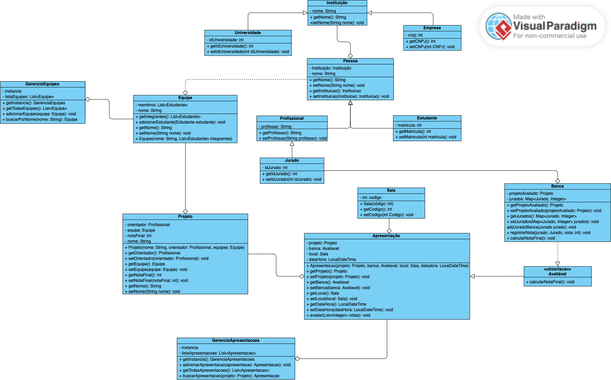

# Sistema de Gerenciamento de Hackathons Universitários 🎓🏆

Este projeto consiste no desenvolvimento de um Sistema de Gerenciamento de Hackathons Universitários, voltado para a gestão de Equipes, Projetos, Jurados, Bancas Avaliadoras e Apresentações.  

O sistema foi desenvolvido utilizando Java, com foco em Programação Orientada a Objetos (POO) e implementação de conceitos como Herança, Polimorfismo, Composição e o Padrão Singleton, garantindo que as classes de gerenciamento de coleções (como equipes e projetos) tenham apenas uma instância durante a execução. Toda a gestão é feita em memória, utilizando coleções Java como List e Map, sem necessidade de banco de dados. Além disso, foi utilizada a Streams API para realizar filtros, como a listagem de projetos com nota final igual ou superior a 7.

## 📌 Objetivo do Projeto

O principal foco desta aplicação é implementar as funcionalidades responsáveis por:

- Gerenciar as Equipes participantes
- Cadastrar e vincular Projetos a essas equipes
- Criar Bancas de Avaliação compostas por Jurados
- Realizar Apresentações de Projetos para as Bancas
- Calcular e armazenar as notas finais de cada projeto

## 🛠️ Funcionalidades Implementadas

- Cadastro de Equipes e seus integrantes
- Vinculação de Projetos a cada Equipe
- Definição de um Orientador para cada Projeto
- Criação de Bancas Avaliadoras com 4 jurados
- Registro de notas individuais por jurado
- Cálculo da nota final de cada Projeto (média das notas dos jurados)
- Cadastro e agendamento das Apresentações
- Listagem de todos os projetos que atingiram nota final ≥ 7 (usando Streams API)

## 📚 Diagrama UML

## 👩‍💻 Desenvovedoras
- Ana Luiza de Freitas Rodrigues
- Júlia de Souza Ventura
